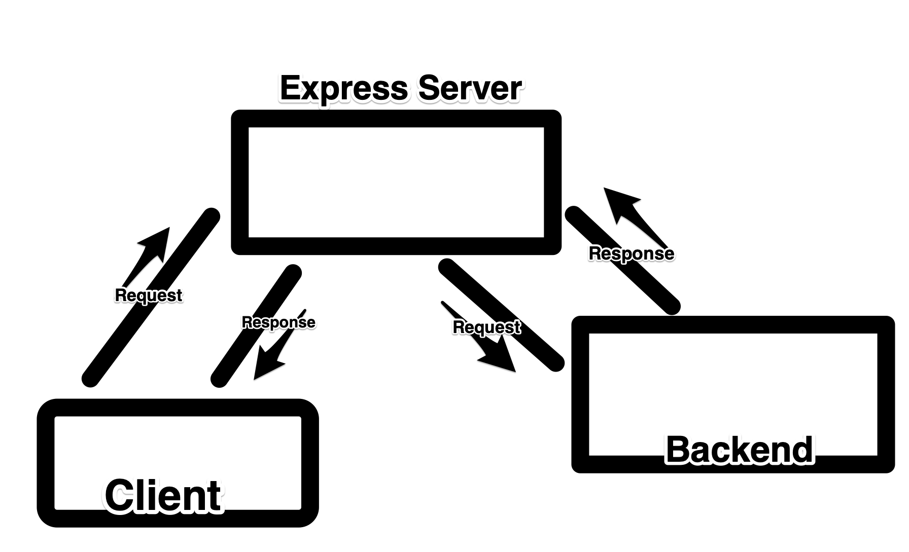
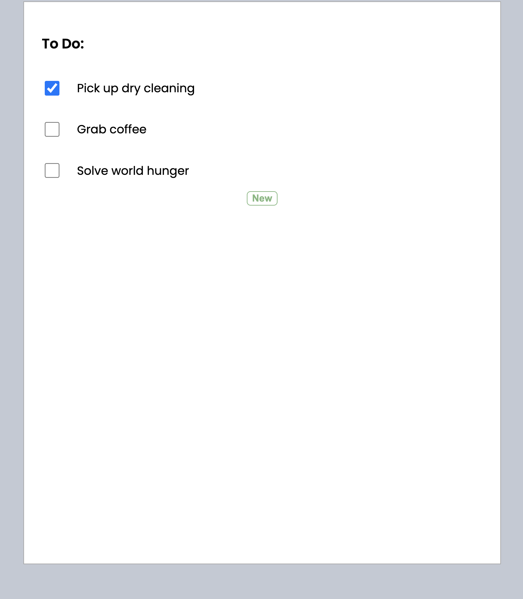
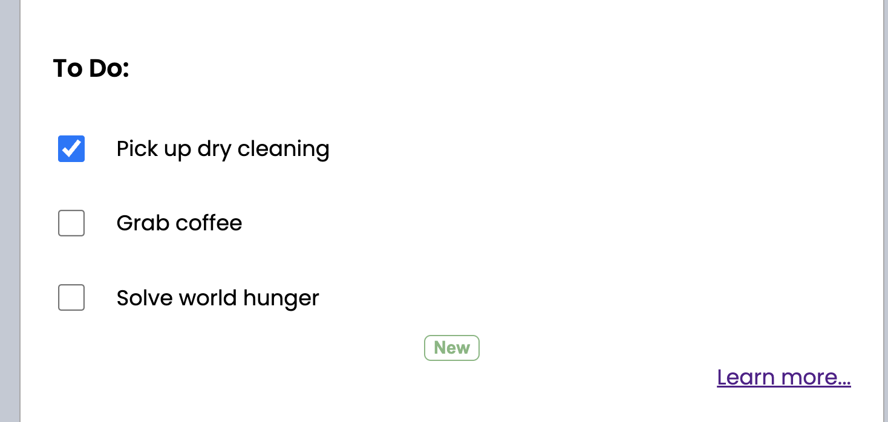
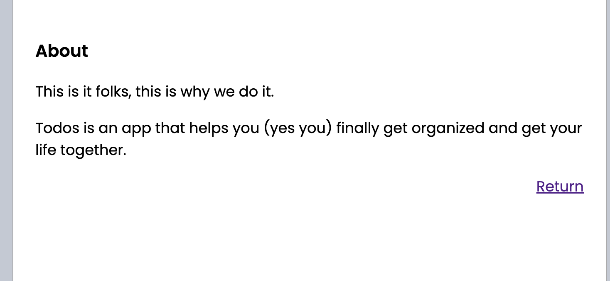

# Embed React in Golang

In this article we'll learn how to embed a React single page application (SPA) in our Go backend. If you're itching to look at code you can get started with our implementation [here](#getting-started) or view the final source code in the [embeddable-react-final](https://github.com/observIQ/embeddable-react-final).

In the meantime its worth discussing the problem that we're here to solve and why this is a great solution for certain use cases.

## The Problem

Imagine this: you've built an application and API in Go, maybe in use by a command line client or with REST. One day your project manager emerges from playing Elden Ring long enough to inform you that your customers demand a graphical user interface.

OK - no big deal you can write a simple React App to use your API... except your simple Web API which previously was deployed with a single binary now needs some dependencies. Some current React frameworks like NextJS or Gatsby are well supported but might be overkill and not as flexible as you might like.

Typically you might deploy a front end application like this.



Where the browser is sending requests directly to end points on the same host. This middle-man server then forwards these requests onto the backend API where all of the logic is handled, and in turn sends that response back to the browser.

Maybe this is what you want. You might want to obfuscate your backend from the rest of the internet. In the case though that your API is already exposed there is a very elegant and simple solution, that avoids Node dependencies and running multiple services.

## Prerequisites (TODO)

## Getting started

So lets start off with a basic Go API and React App.

```sh
git clone https://github.com/observIQ/embeddable-react.git
```

Here we have or "To Do" application. A cornerstone of web development tutorials and this article will be no different.

Without getting into too much detail we have a REST API which is implemented in `api/` and a React app in `ui/`.

Lets start the API server. From the project directory:

```sh
go mod tidy
go run .
```

We can see we have a REST API listening on port 4000.

```
[GIN-debug] [WARNING] Creating an Engine instance with the Logger and Recovery middleware already attached.

[GIN-debug] [WARNING] Running in "debug" mode. Switch to "release" mode in production.
 - using env:	export GIN_MODE=release
 - using code:	gin.SetMode(gin.ReleaseMode)

[GIN-debug] GET    /api/todos                --> github.com/observiq/embeddable-react/api.addRoutes.func1 (3 handlers)
[GIN-debug] POST   /api/todos                --> github.com/observiq/embeddable-react/api.addRoutes.func2 (3 handlers)
[GIN-debug] DELETE /api/todos/:id            --> github.com/observiq/embeddable-react/api.addRoutes.func3 (3 handlers)
[GIN-debug] PUT    /api/todos/:id            --> github.com/observiq/embeddable-react/api.addRoutes.func4 (3 handlers)
[GIN-debug] [WARNING] You trusted all proxies, this is NOT safe. We recommend you to set a value.
Please check https://pkg.go.dev/github.com/gin-gonic/gin#readme-don-t-trust-all-proxies for details.
[GIN-debug] Listening and serving HTTP on :4000
```

Now, in a separate shell window, lets start our React app.

```sh
cd ui && npm install && npm start
```

Now we're running our React app in development mode, go ahead and navigate to http://localhost:3000 and take a look at our React App. You should see some TODOs.



And sure enough our API got some hits:

```
[GIN] 2022/03/31 - 16:51:51 | 200 | 192.723µs | 127.0.0.1 | GET "/api/todos"

```

You might be asking _"How did this even work?"_. Good question!

Answer: Magic.

Well... at least `create-react-app` magic.

Check out `ui/package.json` line 5.

```json
{
  "name": "todos",
  "version": "0.1.0",
  "private": true,
  "proxy": "http://localhost:4000"
  //...
}
```

We used `create-react-app` to bootstrap our `ui` directory and so we can uitlize a built in development proxy server.

You see when we run `npm start` behind the scenes an express server is spun up, serving our html, javascript, and css. It also creates a websocket connection witho our front end for pushing updates from the code when we save.

While this works great in development. However this "proxy server" doesn't exist for a production environment, we're responsible for serving the static files ourselves.

## Embedding static files into our program

We need away to serve a built React application from our Go API. To do this we can utilize the Go [embed](https://pkg.go.dev/embed) package to serve our file system.

First, lets make our production build. In `ui/` run

```sh
npm run build
```

We now have a `build` folder with some files in it:

```
└── ui
    ├── src
    ├── node_modules
    ├── package-lock.json
    ├── package.json
    ├── public
    └── build
          ├── asset-manifest.json
          ├── index.html
          └── static
              ├── css
              │   ├── main.xxxxxxxx.css
              │   └── main.xxxxxxxx.css.map
              └── js
                  ├── main.xxxxxxxx.js
                  ├── main.xxxxxxxx.js.LICENSE.txt
                  └── main.xxxxxxxx.js.map
```

By running `npm run build` we've boiled our app down to a couple of static files.

From the project directory:

```sh
touch ui/ui.go
```

And copy and paste this code:

```go
package ui

import (
	"embed"
	"fmt"
	"io/fs"
	"net/http"
	"strings"

	"github.com/gin-gonic/contrib/static"
	"github.com/gin-gonic/gin"
)

//go:embed build
var staticFS embed.FS

// AddRoutes serves the static file system for the UI React App.
func AddRoutes(router gin.IRouter) {
	embeddedBuildFolder := newStaticFileSystem()
	router.Use(static.Serve("/", embeddedBuildFolder))
}

// ----------------------------------------------------------------------
// staticFileSystem serves files out of the embedded build folder

type staticFileSystem struct {
	http.FileSystem
}

var _ static.ServeFileSystem = (*staticFileSystem)(nil)

func newStaticFileSystem() *staticFileSystem {
	sub, err := fs.Sub(staticFS, "build")

	if err != nil {
		panic(err)
	}

	return &staticFileSystem{
		FileSystem: http.FS(sub),
	}
}

func (s *staticFileSystem) Exists(prefix string, path string) bool {
	buildpath := fmt.Sprintf("build%s", path)

	// support for folders
	if strings.HasSuffix(path, "/") {
		_, err := staticFS.ReadDir(strings.TrimSuffix(buildpath, "/"))
		return err == nil
	}

	// support for files
	f, err := staticFS.Open(buildpath)
	if f != nil {
		_ = f.Close()
	}
	return err == nil
}

```

Now run:

```sh
go mod tidy
```

Lets break this down a bit. Note lines 14 and 15.

```go
//go:embed build
var staticFS embed.FS
```

This is utilizing the `go:embed` directive to save the contents of the `build` directory as a filesystem.

We now need to use this in a way that Gin can serve it as middleware so we create a struct `staticFileSystem` that implements `static.ServeFileSystem`. To do this we need to add the Exists method:

```go
func (s *staticFileSystem) Exists(prefix string, path string) bool {
	buildpath := fmt.Sprintf("build%s", path)

	// support for folders
	if strings.HasSuffix(path, "/") {
		_, err := staticFS.ReadDir(strings.TrimSuffix(buildpath, "/"))
		return err == nil
	}

	// support for files
	f, err := staticFS.Open(buildpath)
	if f != nil {
		_ = f.Close()
	}
	return err == nil
}
```

This is essentially telling Gin that if the client requests `build/index.html` that that file exists and is served.

Now we can use it in Gin middleware, line 21:

```go
router.Use(static.Serve("/", embeddedBuildFolder))
```

Lets add this route in our `api/start.go` file, which now looks like:

```go
package api

import (
	"github.com/gin-gonic/gin"

	"github.com/observiq/embeddable-react/ui"
)

func Start() {
	store := newStore()
	router := gin.Default()

	addRoutes(router, store)
	ui.AddRoutes(router)

	router.Run(":4000")
}

```

Lets build the binary and see it in action. In the project root directory:

```sh
go build
```

```sh
./embeddable-react
```

We should see our server spin up. Now navigate to our _backend_ server host [localhost:4000](http:/localhost:4000) and voila!


We have React app running with **no express server** and **no node dependencies**. You can hand this off as an RPM or DEB package or even make available to Homebrew.

## The Refresh Problem

Ok very cool, we got a single page being hosted. But lets say we want _another_ page. Customers these days demand websites with multiple pages and we have to be agile and support this ridiculous request. So lets add an About page and utilize React Router to navigate to it.

So in `ui/`

```sh
npm install react-router-dom
```

Lets add an About page. From the project directory:

```sh
touch ui/src/components/About.jsx
```

Copy this into it.

```jsx
import React from "react";
import { Link } from "react-router-dom";

export const About = () => {
  return (
    <>
      <h3>About</h3>
      <p>This is it folks, this is why we do it.</p>
      <p>
        Todos is an app that helps you (yes you) finally get organized and get
        your life together.
      </p>

      <Link className="nav-link" to={"/"}>
        Return
      </Link>
    </>
  );
};
```

Now add a Link to it in our `ui/src/components/Todos.jsx` file.

```jsx
import React, { useState } from "react";
import { useCallback } from "react";
import { useEffect } from "react";
import { NewTodoInput } from "./NewTodoForm";
import { Todo } from "./Todo";
import { Link } from "react-router-dom";

export const Todos = () => {
  const [todos, setTodos] = useState([]);

  const fetchTodos = useCallback(async () => {
    const resp = await fetch("/api/todos");
    const body = await resp.json();
    const { todos } = body;

    setTodos(todos);
  }, [setTodos]);

  useEffect(() => {
    fetchTodos();
  }, [fetchTodos]);

  function onDeleteSuccess() {
    fetchTodos();
  }

  function onCreateSuccess(newTodo) {
    setTodos([...todos, newTodo]);
  }

  return (
    <>
      <h3>To Do:</h3>
      <div className="todos">
        {todos.map((todo) => (
          <Todo key={todo.id} todo={todo} onDeleteSuccess={onDeleteSuccess} />
        ))}
      </div>
      <NewTodoInput onCreateSuccess={onCreateSuccess} />
      <Link to="/about" className="nav-link">
        Learn more...
      </Link>
    </>
  );
};
```

And finally add these routes with React Router. Our `ui/App.jsx` now looks like this:

```jsx
import { Todos } from "./components/Todos";
import { About } from "./components/About";
import { BrowserRouter, Routes, Route } from "react-router-dom";

function App() {
  return (
    <BrowserRouter>
      <Routes>
        <Route
          path="/"
          element={
            <div className="container">
              <Todos />
            </div>
          }
        />
        <Route
          path="/about"
          element={
            <div className="container">
              <About />
            </div>
          }
        />
      </Routes>
    </BrowserRouter>
  );
}

export default App;
```

Now lets rebuild our app and start it again.

```sh
cd ui && npm run build && cd .. &&  go build && ./embeddable-react
```



And when we navigate to it:



Great! Only problem is... hit **Refresh**.


This is unfortunate, but not surprising. Essentially when we it refresh we told the server we're looking for the file at `ui/build/about` - which of course doesn't exist. React Router manages the history state of the broswer to make it appear as if we're navigating to new pages, but the HTML of our document is still `index.html`. How do we get around this?

**Bonus**: For further explanation on this phenomenon check out Stijn de Witt's answer to [this stack overflow question](https://stackoverflow.com/questions/27928372/react-router-urls-dont-work-when-refreshing-or-writing-manually). We should all be as thorough as Stijn.

### Create a fallback filesystem

Essentially we want to _always_ server `index.html` on our `/` route. So, lets add some stuff to `ui/ui.go`.

```go
package ui

import (
	"embed"
	"fmt"
	"io/fs"
	"net/http"
	"strings"

	"github.com/gin-gonic/contrib/static"
	"github.com/gin-gonic/gin"
)

//go:embed build
var staticFS embed.FS

// AddRoutes serves the static file system for the UI React App.
func AddRoutes(router gin.IRouter) {
	embeddedBuildFolder := newStaticFileSystem()
	fallbackFileSystem := newFallbackFileSystem(embeddedBuildFolder)
	router.Use(static.Serve("/", embeddedBuildFolder))
	router.Use(static.Serve("/", fallbackFileSystem))
}

// ----------------------------------------------------------------------
// staticFileSystem serves files out of the embedded build folder

type staticFileSystem struct {
	http.FileSystem
}

var _ static.ServeFileSystem = (*staticFileSystem)(nil)

func newStaticFileSystem() *staticFileSystem {
	sub, err := fs.Sub(staticFS, "build")

	if err != nil {
		panic(err)
	}

	return &staticFileSystem{
		FileSystem: http.FS(sub),
	}
}

func (s *staticFileSystem) Exists(prefix string, path string) bool {
	buildpath := fmt.Sprintf("build%s", path)

	// support for folders
	if strings.HasSuffix(path, "/") {
		_, err := staticFS.ReadDir(strings.TrimSuffix(buildpath, "/"))
		return err == nil
	}

	// support for files
	f, err := staticFS.Open(buildpath)
	if f != nil {
		_ = f.Close()
	}
	return err == nil
}

// ----------------------------------------------------------------------
// fallbackFileSystem wraps a staticFileSystem and always serves /index.html
type fallbackFileSystem struct {
	staticFileSystem *staticFileSystem
}

var _ static.ServeFileSystem = (*fallbackFileSystem)(nil)
var _ http.FileSystem = (*fallbackFileSystem)(nil)

func newFallbackFileSystem(staticFileSystem *staticFileSystem) *fallbackFileSystem {
	return &fallbackFileSystem{
		staticFileSystem: staticFileSystem,
	}
}

func (f *fallbackFileSystem) Open(path string) (http.File, error) {
	return f.staticFileSystem.Open("/index.html")
}

func (f *fallbackFileSystem) Exists(prefix string, path string) bool {
	return true
}
```

We've added a couple things here, Notably our newest struct `fallbackFileSystem`. We've implemented our own methods for
`Exists` and `Open`, making it so that it will always return `index.html`.

Secondly we've added some more middleware in `AddRoutes`:

```go
func AddRoutes(router gin.IRouter) {
	embeddedBuildFolder := newStaticFileSystem()
	fallbackFileSystem := newFallbackFileSystem(embeddedBuildFolder)
	router.Use(static.Serve("/", embeddedBuildFolder))
	router.Use(static.Serve("/", fallbackFileSystem))
}
```

The order is important here, the first middleware checks to see if the file exists, making sure our CSS and JavaScript static files are available. It will serve them accordingly when the browswer requests.

Next we say "OK OK we dont have _that_ file, but we **do** have a nice index file." This is the english translation of line 5 above.

Lets rebuild and try again.

```sh
cd ui && npm run build && cd ..  && go build && ./embeddable-react
```

Now after refresh on `/about` we see our About page in all its glory. A multi paged, single page React App embedded in a binary. Magic.

## Caveats TODO
